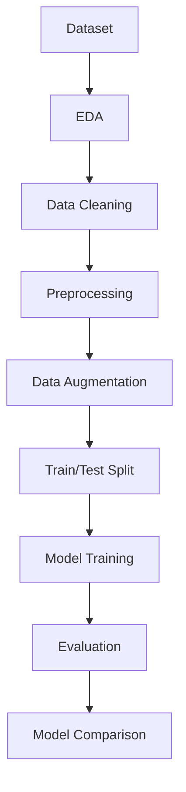

# 🌫️ Fog vs Smog Detection using Deep Learning 🚀

<p align="center">
  
  
  
  
</p>

<p align="center">
  
</p>

---

## 📌 Project Overview

An **AI-powered Computer Vision system** that classifies environmental images into:

- 🌫️ **Foggy**
- 🌤️ **Clear / Smog**

This project implements a **complete deep learning pipeline** from raw dataset → preprocessing → training → evaluation → model comparison.

---

## 🎯 Objectives

✔️ Detect atmospheric conditions using images  
✔️ Perform detailed **EDA (Exploratory Data Analysis)**  
✔️ Apply **image preprocessing & augmentation**  
✔️ Train multiple **Deep Learning models**  
✔️ Compare performance using real metrics  

---

## 🧠 Tech Stack

<p align="center">
  
</p>

---

## ⚙️ Workflow Pipeline



---

## 📂 Dataset Info

| Feature | Details |
|--------|--------|
| Source | Kaggle |
| Classes | Clear, Foggy |
| Images | ~2300+ |
| Type | Image Classification |

---

## 🔍 Exploratory Data Analysis

✔️ Class distribution visualization  
✔️ Image brightness & size analysis  
✔️ RGB histogram comparison  
✔️ Data quality checks (duplicates, corruption)

---

## 🛠️ Preprocessing

- 📏 Resize → **224x224**
- 🎨 Convert → RGB
- 🔢 Normalize → [0,1]
- 🔄 Augmentation:
  - Flip
  - Rotation
  - Zoom
  - Brightness

---

## 🤖 Models Used

| Model | Type | Description |
|------|------|------------|
| 🧱 Custom CNN | Baseline | Built from scratch |
| ⚡ MobileNetV2 | Transfer Learning | Lightweight & fast |
| 🚀 EfficientNetB0 | Transfer Learning | High performance |

---

## 📊 Results

<p align="center">
  
  
  
</p>

✔️ High accuracy across all models  
✔️ Transfer learning models performed best  
✔️ Strong generalization on unseen data  

---

## 📈 Evaluation Metrics

- ✅ Accuracy  
- 🎯 Precision  
- 🔁 Recall  
- 📊 F1-Score  
- 🔲 Confusion Matrix  

---

## 🚀 How to Run

### 🔹 Clone Repo
```bash
git clone https://github.com/your-username/fog-smog-detection.git
cd fog-smog-detection
```

### 🔹 Install Dependencies
```bash
pip install -r requirements.txt
```

### 🔹 Run Project
```bash
python smog_or_fog_detection.py
```

---

## 📁 Outputs Generated

📊 EDA Visualizations  
📄 CSV Reports  
🖼️ Image Analysis Graphs  
📦 Preprocessed Dataset  
🤖 Trained Models  
📉 Evaluation Reports  

---

## 🔮 Future Improvements

- 🌐 Deploy using **Streamlit / Flask**
- 📷 Real-time camera detection
- 🌍 Smart city integration
- 🤖 Edge AI deployment (ESP32 / IoT)

---

## 💡 Use Cases

🏙️ Smart Cities  
🌫️ Pollution Monitoring  
🚗 Autonomous Driving  
🌦️ Weather Detection Systems  

---

## 👨‍💻 Author

**Itqa Akhlaq**  
🎓 BS Information Technology  
🤖 AI | ML | Computer Vision Enthusiast  

---

## ⭐ Support

If you like this project:

⭐ Star this repo  
🍴 Fork it  
📢 Share it  

---

<p align="center">
  
</p>
